# 📊 SEAGMA PRESENCE - Diagram Alur Data

> Dokumentasi lengkap alur data sistem SEAGMA PRESENCE

---

## 1. Alur Data Sistem Tingkat Tinggi

---

## 2. Alur Autentikasi & Binding Perangkat

```mermaid
sequenceDiagram
    autonumber
    participant U as 👤 User
    participant App as 📱 App
    participant DS as DeviceService
    participant PB as ☁️ PocketBase
    
    U->>App: Buka Aplikasi
    App->>DS: getDeviceId()
    DS-->>App: device_id
    
    U->>App: Login (email, password)
    App->>PB: POST /api/collections/users/auth-with-password
    PB-->>App: auth_token + user_data
    
    alt Login Pertama (Belum ada Device Terikat)
        App->>PB: PATCH /users/{id} {registered_device_id: device_id}
        PB-->>App: ✅ Perangkat Terdaftar
    else Perangkat Sudah Terikat
        alt device_id == registered_device_id
            App-->>U: ✅ Login Sukses
        else device_id != registered_device_id
            App-->>U: 🚫 DIBLOKIR - Perangkat Tidak Cocok
            Note over U,PB: User harus hubungi HR untuk reset perangkat
        end
    end
```

---

## 3. Alur Check-In Absensi

```mermaid
flowchart TB
    Start([👆 User Tap Check-In]) --> ValidateDevice{Device ID<br/>Valid?}
    
    ValidateDevice -->|❌ Tidak Cocok| BlockDevice[🚫 DIBLOKIR<br/>Hubungi HR]
    ValidateDevice -->|✅ Cocok| CheckMock{Mock Location<br/>Terdeteksi?}
    
    CheckMock -->|❌ Terdeteksi| BlockMock[🚫 DIBLOKIR<br/>Fake GPS Terdeteksi]
    CheckMock -->|✅ Bersih| CheckTime{Waktu<br/>Dimanipulasi?}
    
    CheckTime -->|❌ Terdeteksi| BlockTime[🚫 DIBLOKIR<br/>Waktu Curang]
    CheckTime -->|✅ Valid| CheckWifi{Terhubung ke<br/>WiFi Kantor?}
    
    CheckWifi -->|✅ BSSID Cocok| AutoValid[✅ OTOMATIS VALID<br/>WiFi Terverifikasi]
    CheckWifi -->|❌ Tidak Terhubung| CheckGPS{GPS di<br/>Radius Kantor?}
    
    CheckGPS -->|✅ Dalam Jangkauan| GPSValid[✅ VALID<br/>GPS Terverifikasi]
    CheckGPS -->|❌ Luar Jangkauan| BlockGPS[🚫 DIBLOKIR<br/>Di Luar Area]
    
    AutoValid --> SaveAttendance
    GPSValid --> SaveAttendance
    
    SaveAttendance[💾 Simpan Rekam Absensi] --> CheckNetwork{Internet<br/>Tersedia?}
    
    CheckNetwork -->|✅ Online| SyncServer[☁️ Sync ke PocketBase]
    CheckNetwork -->|❌ Offline| SaveLocal[(📱 Simpan ke Isar<br/>Antrean Sync)]
    
    SyncServer --> Success([✅ Check-In Selesai])
    SaveLocal --> Success
```

---

## 4. Alur Check-Out Absensi

```mermaid
flowchart TB
    Start([👆 User Mengetuk Check-Out]) --> HasCheckIn{Ada Check-In<br/>Aktif?}
    
    HasCheckIn -->|❌ Tidak| Error[⚠️ Error<br/>Tidak Ada Check-In Aktif]
    HasCheckIn -->|✅ Ya| ValidateLocation{Lokasi<br/>Valid?}
    
    ValidateLocation -->|❌ Tidak Valid| AllowAnyway{Izinkan Check-Out<br/>Di Luar Kantor?}
    AllowAnyway -->|Config: Ya| FlagAnomaly[⚠️ Tandai Anomali]
    AllowAnyway -->|Config: Tidak| BlockCheckOut[🚫 DIBLOKIR]
    
    ValidateLocation -->|✅ Valid| CalculateHours[📊 Hitung Jam Kerja]
    FlagAnomaly --> CalculateHours
    
    CalculateHours --> CheckShift{Sesuai Jam<br/>Shift?}
    
    CheckShift -->|✅ Normal| SaveCheckOut[💾 Simpan Check-Out]
    CheckShift -->|⏰ Pulang Cepat| EarlyReason[📝 Minta Alasan Pulang Cepat]
    CheckShift -->|⏰ Lembur| OvertimeCalc[📊 Hitung Lembur]
    
    EarlyReason --> SaveCheckOut
    OvertimeCalc --> SaveCheckOut
    
    SaveCheckOut --> SyncData[☁️ Sync ke Server]
    SyncData --> Success([✅ Check-Out Selesai])
```

---

## 5. Alur Data Sync Offline

---

## 6. Alur Data Validasi Lokasi

```mermaid
flowchart LR
    subgraph Input["📍 Sumber Lokasi"]
        GPS[Sensor GPS]
        WiFi[Pemindai WiFi]
    end
    
    subgraph Validation["🔍 Layer Validasi"]
        MockCheck{Deteksi<br/>Mock Location}
        BSSIDCheck{Validasi<br/>BSSID}
        GeoCheck{Cek<br/>Geofence}
    end
    
    subgraph Output["📊 Hasil"]
        Valid[✅ VALID]
        Invalid[❌ INVALID]
        Reason[📝 Kode Alasan]
    end
    
    GPS --> MockCheck
    MockCheck -->|Bersih| GeoCheck
    MockCheck -->|Terdeteksi| Invalid
    
    WiFi --> BSSIDCheck
    BSSIDCheck -->|Cocok| Valid
    BSSIDCheck -->|Tidak Cocok| GeoCheck
    
    GeoCheck -->|Dalam Jangkauan| Valid
    GeoCheck -->|Luar Jangkauan| Invalid
    
    Invalid --> Reason
```

---

## 7. Alur Data Validasi Waktu

```mermaid
flowchart TB
    subgraph Sources["⏰ Sumber Waktu"]
        Device[Waktu Perangkat]
        NTP[Server NTP]
        Boot[Waktu Boot + Berlalu]
    end
    
    subgraph Validation["🔍 Validasi"]
        Compare{Bandingkan Waktu}
        Threshold{Beda > 5 menit?}
    end
    
    subgraph Result["📊 Hasil"]
        Trusted[✅ Waktu Terpercaya]
        Flagged[⚠️ Manipulasi Waktu]
    end
    
    NTP --> Compare
    Device --> Compare
    
    Compare --> Threshold
    Threshold -->|Ya| Flagged
    Threshold -->|Tidak| Trusted
    
    NTP -.->|Fallback jika tidak tersedia| Boot
    Boot --> Compare
```

---

## 8. Alur Data Pembuatan Laporan

```mermaid
flowchart TB
    subgraph Request["📝 Permintaan Laporan"]
        User[User Admin/HR]
        Params[Parameter Filter:<br/>Rentang Tanggal, Departemen, User]
    end
    
    subgraph Processing["⚙️ Pemrosesan"]
        Query[Query Data Absensi]
        Aggregate[Agregasi Statistik]
        Calculate[Hitung Metrik:<br/>- Total Jam<br/>- Jumlah Telat<br/>- Jam Lembur<br/>- Anomali]
    end
    
    subgraph Output["📤 Output"]
        Preview[Preview di App]
        PDF[Export PDF]
        Excel[Export Excel]
    end
    
    User --> Params
    Params --> Query
    Query --> Aggregate
    Aggregate --> Calculate
    
    Calculate --> Preview
    Calculate --> PDF
    Calculate --> Excel
```

---

## 9. Entity Relationship Diagram

---

## 10. State Machine - Status Absensi

---

> **Versi Dokumen:** 1.1  
> **Terakhir Diupdate:** 06-02-2026  
> **Penulis:** AI Architect Assistant (Phase 4 Hardening)
