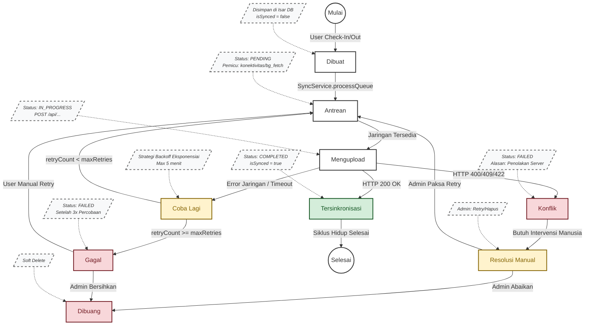

# 🫀 MESIN SINKRONISASI "JANTUNG" (HEARTBEAT) — Diagram Status

Dokumen ini merinci mesin status (state machine) yang mengatur siklus hidup setiap catatan lokal (`AttendanceLocal`, `NotificationLocal`, `UserLocal`, `LeaveRequestLocal`), memastikan integritas data dalam lingkungan offline-first.

## Diagram Status



## Konfigurasi Mesin Sinkronisasi

| Parameter | Nilai | Rasional |
|-----------|-------|----------|
| **Max Retries** | 3 | Keseimbangan antara kegigihan dan baterai |
| **Base Backoff** | 1 detik | Percobaan ulang pertama cepat untuk kegagalan sesaat |
| **Max Backoff** | 5 menit | Mencegah membanjiri server saat gangguan |
| **Interval Background** | 15 menit | Batasan iOS + Mode Doze Android |
| **Ukuran Batch Antrean** | 10 rekaman | Mencegah timeout pada sinkronisasi massal |
| **Timeout Upload Foto** | 60 detik | File besar pada jaringan 3G lambat |

## Logika Backoff Eksponensial

Mekanisme percobaan ulang menggunakan strategi backoff eksponensial untuk mencegah kelebihan beban server dan menghemat baterai.

```dart
int getBackoffDuration(int retryCount) {
  // delay = min(2^retryCount * 1000, 300000) milidetik
  final delay = (1 << retryCount) * 1000; // 2^n * 1 detik
  return delay.clamp(1000, 300000); // Min 1s, Max 5 menit
}
```
